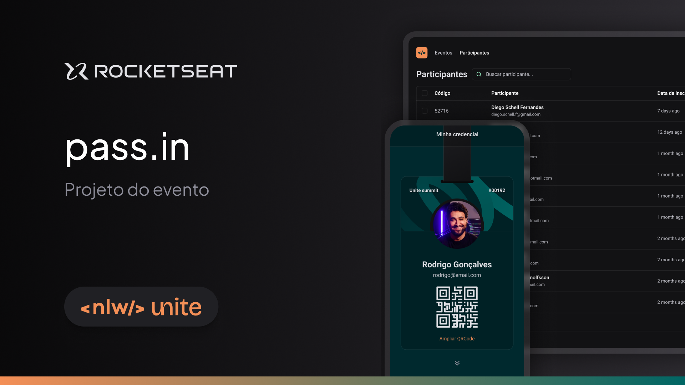

# :rocket: pass in
Projeto desenvolvido pela Rocketseat, no evento NLW Unite, para o ensino de tecnologias Web

[Tecnologias](#tecnologias)
[Como executar](#como-executar)
[Layout](#layout)

## Projeto
O projeto é uma aplicação para gerenciar pessoas em um evento. 

Na versão mobile, o projeto desenvolvido é para cadastro de pessoas que participarão deste evento, login desse cadastro, fornecendo um QR Code para check-in.

Este é um projeto desenvolvido durante a [Next Level Week Unite](https://www.rocketseat.com.br/nlw), apresentada dos dias 20 a 27 de Junho de 2021.

## Tecnologias:

### Aplicação mobile:
* [React Native](https://reactnative.dev/)
* [TypeScript](https://www.typescriptlang.org/)
* [Nativewind](https://www.nativewind.dev/)

## Como executar:
Clone o projeto e acesse a pasta
~~~ shell
$ git clone https://github.com/pmor4is/pass-in
$ cd pass-in
~~~

Para iniciar a versão mobile, insira os comandos abaixo:
É necessário o Expo instalado no celular para verificar a aplicação. Após inserir os comandos no terminal, irá ser gerado um QR Code, que levará ao aplicativo Expo, que emulará a nossa aplicação
~~~ shell
# abrir a pasta do servidor
cd pass-in-mobile
# instalação das dependências
$ npx install-expo-modules@latest
# inicialização do projeto
$ npx expo start
~~~

## Layout 
O design desse projeto pode ser visualizado através deste [link para o Figma](https://www.figma.com/file/zquiyPLPBUMSNLmk40rmbe/pass.in-(Community)?type=design&node-id=2007-1477&mode=design&t=B9L3REyk0n7jwATg-0). É necessário uma conta para poder visualizar.

## Materiais complementares
O link para o material utilizado para a construção do aplicativo pode ser visualizado no link abaixo:
* [Notion Mobile](https://efficient-sloth-d85.notion.site/React-Native-1d438a20bc5240e0a5c0be518c065246?pvs=25)
